# Data Science Portfolio — CMPE 297

> YOUTUBE_VIDEO_LINK_HERE

Five data science projects in one Streamlit app. Each follows the full CRISP-DM lifecycle, from business framing through live interactive inference. All data is synthetic, generated in-process with fixed seeds. Runs offline with two commands.

## Pages

| Page | Description |
|------|-------------|
| 1 — Trip Duration Predictor | NYC-style taxi trip regression; haversine feature engineering; HistGBR vs linear baseline |
| 2 — Customer Segmentation | RFM KMeans clustering; elbow + silhouette sweep; PCA projection; business personas |
| 3 — Market Basket Analysis | Apriori from scratch (no mlxtend); support/confidence/lift; cart recommendations |
| 4 — Anomaly Detection | Server telemetry; IsolationForest + LOF; PR-AUC; why accuracy is wrong on 2% anomaly data |
| 5 — Time Series Forecasting | Lag-feature regression; TimeSeriesSplit; numpy ACF; recursive forecast with uncertainty band |
| 6 — CRISP-DM & Leakage Audit | Phase walkthrough; leakage audit table; reward hacking; reproducibility |

## Quick Start

```bash
pip install -r requirements.txt
streamlit run app.py
```

No internet required. No API keys. No external data.

## Screenshots

All paths are relative to the repo root and render correctly on GitHub.

### Home


*Sidebar lists all six pages. The main panel shows the intro paragraph and a table mapping each page to its key technique.*

---

### 1 — Trip Duration Predictor


*Business Understanding tab: the problem is framed as quoting trip duration before booking, with RMSE < 5 min as the success criterion and a linear regression baseline to beat.*

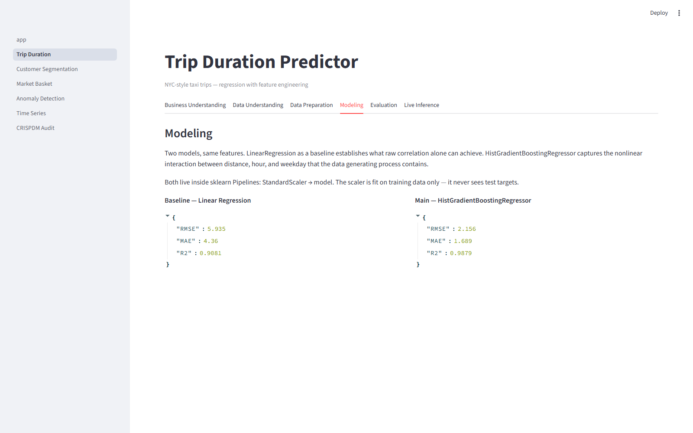
*Modeling tab: side-by-side JSON metrics for LinearRegression (RMSE 5.94, R² 0.908) and HistGradientBoostingRegressor (RMSE 2.16, R² 0.988). Both live inside sklearn Pipelines so the scaler never touches test data.*

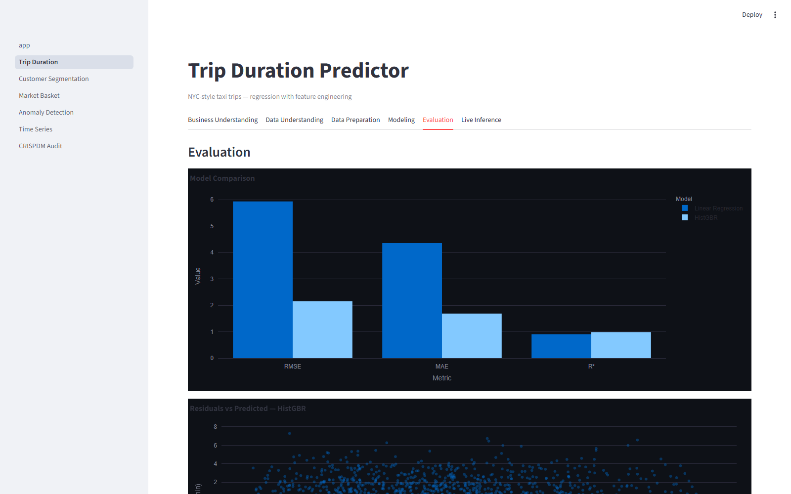
*Evaluation tab: grouped bar chart comparing RMSE, MAE, and R² across both models, followed by the residuals-vs-predicted scatter for the gradient boosted model.*

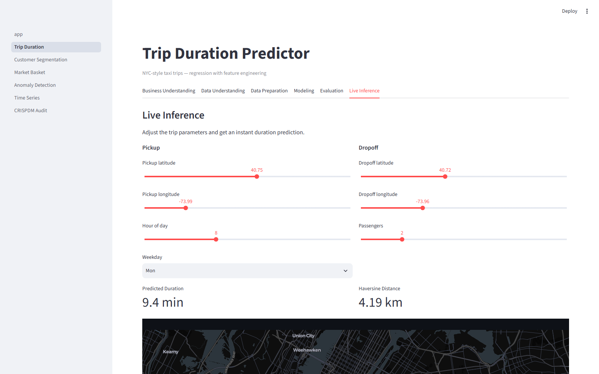
*Live Inference tab: sliders for pickup/dropoff coordinates, hour (8 am), weekday (Monday), and passenger count return a predicted duration of 9.4 min for a 4.19 km trip, with the two endpoints plotted on a dark-theme NYC map.*

---

### 2 — Customer Segmentation


*Business Understanding tab: explains why sending the same email to every customer is wasteful, and frames Recency, Frequency, and Monetary as the three levers.*

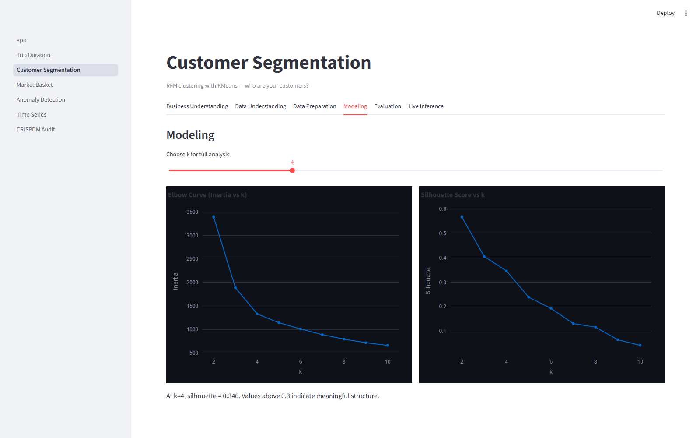
*Modeling tab at k=4: left chart shows the elbow curve (inertia drops steeply to k=4, then flattens); right chart shows silhouette score peaking at k=2 (0.567) and declining steadily. The text notes silhouette 0.346 at k=4.*

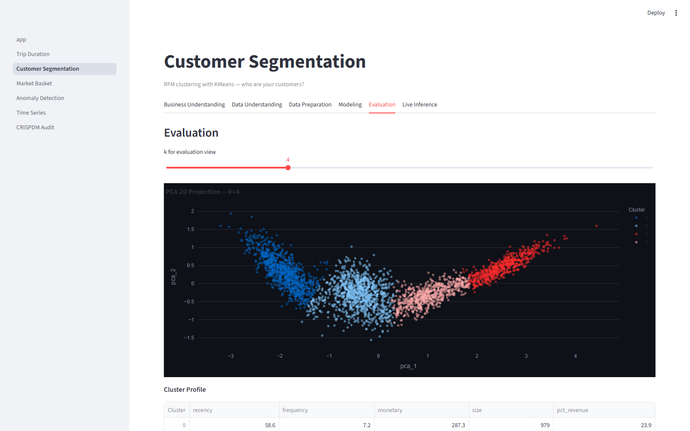
*Evaluation tab: PCA 2D scatter of all 3,000 customers colored by cluster, showing four overlapping but distinct groups. Below it, the cluster profile table lists mean recency, frequency, monetary, size, and revenue share per cluster.*

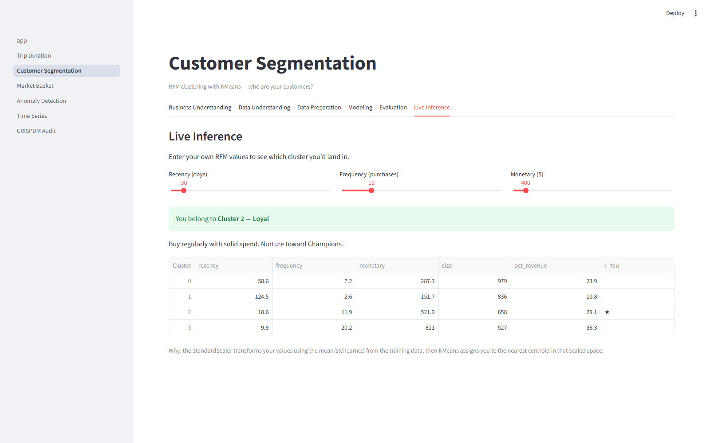
*Live Inference tab: R=30 days, F=10 purchases, M=$400 is assigned to Cluster 2 — Loyal. The profile table marks the matching row with a star. Personas are derived from centroid values at runtime, not hardcoded by cluster ID.*

---

### 3 — Market Basket Analysis


*Business Understanding tab: defines support, confidence, and lift in plain terms, and states the planted rules (e.g. milk → butter) as the ground truth the algorithm should recover.*

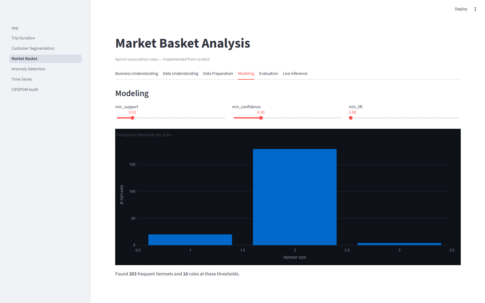
*Modeling tab at default thresholds (support 0.03, confidence 0.30, lift 1.0): bar chart shows frequent itemsets by size — 20 singletons, ~175 pairs, and ~8 triples. The miner found 203 frequent itemsets and 16 rules.*

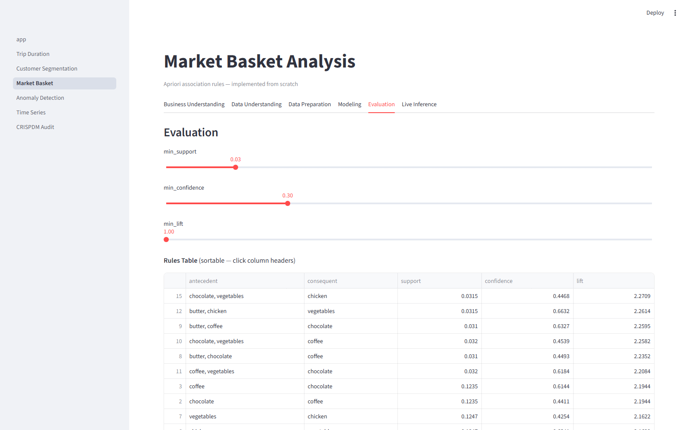
*Evaluation tab: the rules table sorted by lift. The top entries are derived rules (e.g. chocolate, vegetables → chicken, lift 2.27) produced by two planted rules firing together. All four direct planted rules appear further down.*

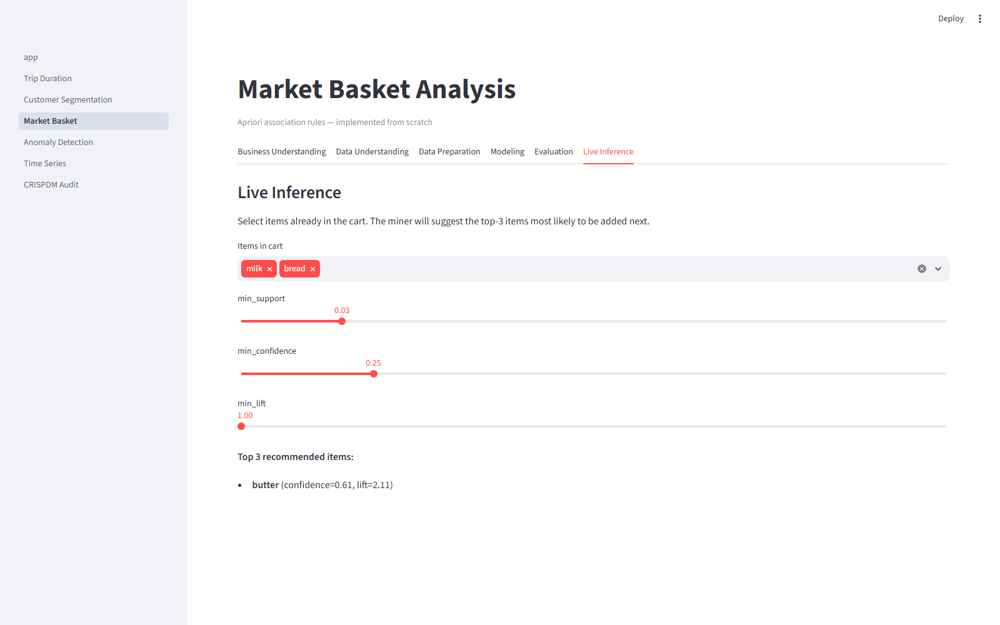
*Live Inference tab: cart contains milk and bread. The miner recommends **butter** (confidence 0.61, lift 2.11) — the planted milk → butter rule recovered at default thresholds.*

---

### 4 — Anomaly Detection


*Business Understanding tab: the 2.0% anomaly rate and the 98.0% majority-class accuracy are shown as metric cards to make the class-imbalance problem concrete before introducing PR-AUC.*

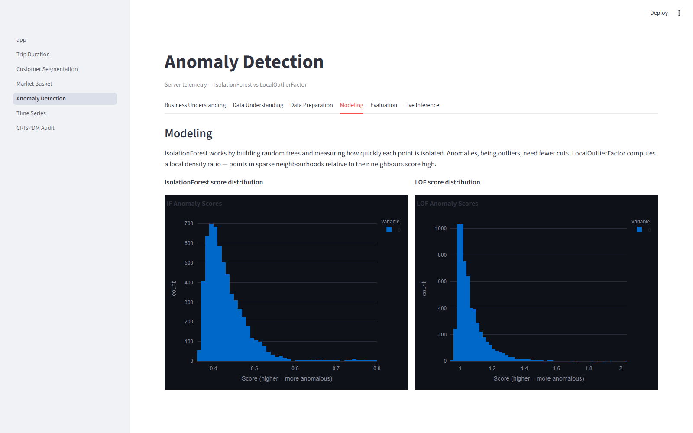
*Modeling tab: IsolationForest scores (left) show a right-skewed distribution with a long tail toward 0.8, where anomalies concentrate. LOF scores (right) are more extreme in shape, with most records near 1.0 and genuine outliers scattered past 1.5.*

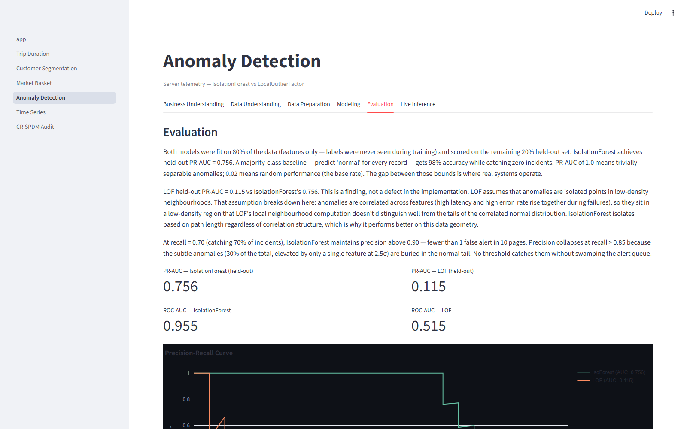
*Evaluation tab: both models fit on 80% training split (features only), scored on the 20% held-out set. IsolationForest PR-AUC 0.756 vs LOF 0.115, ROC-AUC 0.955 vs 0.515. The prose explains why LOF's local-density assumption fails on correlated multivariate data. The precision-recall curve shows IsolationForest holding precision above 0.90 until recall 0.70.*

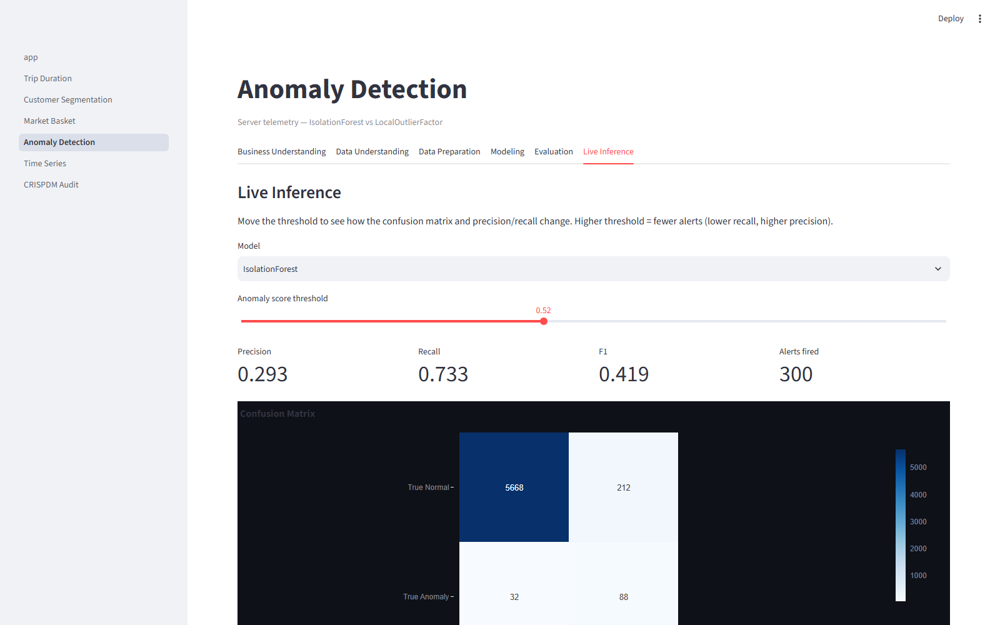
*Live Inference tab: threshold 0.52 yields precision 0.300, recall 0.750, F1 0.429, and 300 alerts fired. The confusion matrix shows 5,670 true negatives, 210 false positives, 30 false negatives, and 90 true positives.*

---

### 5 — Time Series Forecasting


*Business Understanding tab: frames the retail demand problem (7–90 day horizon), names MAPE as the right metric, and states that TimeSeriesSplit enforces a strict no-future-training constraint.*

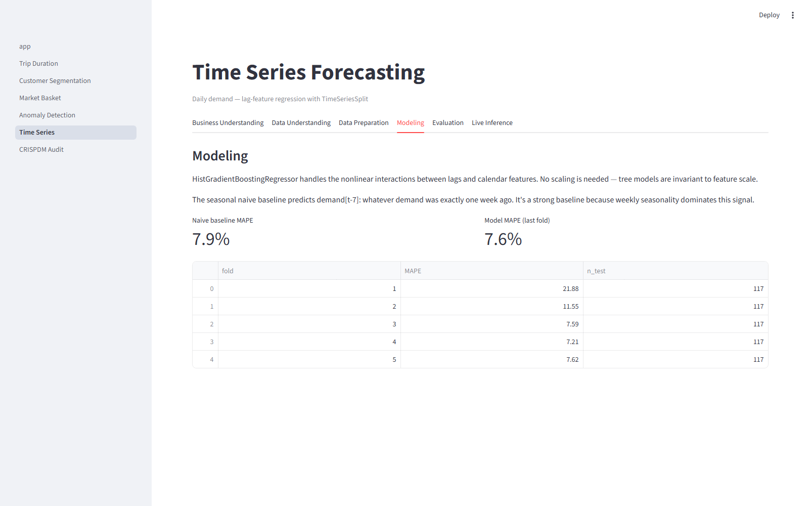
*Modeling tab: seasonal naive baseline MAPE 7.9% vs model MAPE on the last fold 7.6%. The five-fold table shows fold 1 at 21.88% (only five months of training, yearly cycle unseen), declining to 7.2–7.6% once the model has a full year of history.*

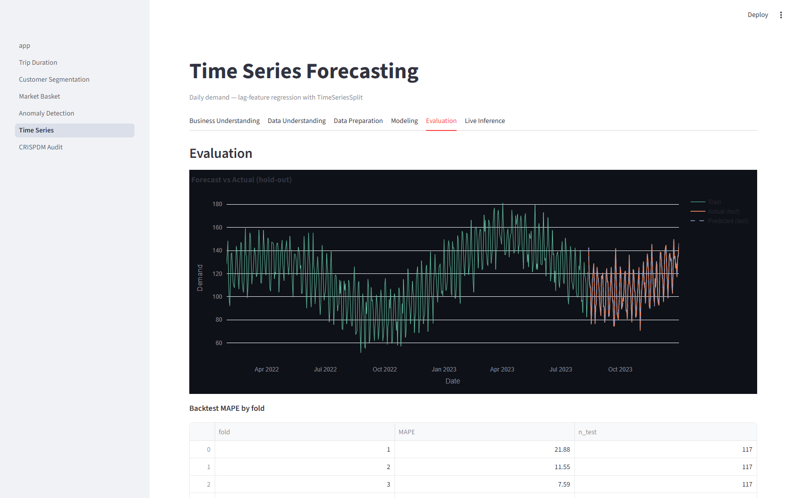
*Evaluation tab: "Forecast vs Actual (hold-out)" overlays training history (green), held-out actuals (orange), and model predictions (dashed). The weekly and yearly oscillations are visible. The backtest MAPE table appears below.*

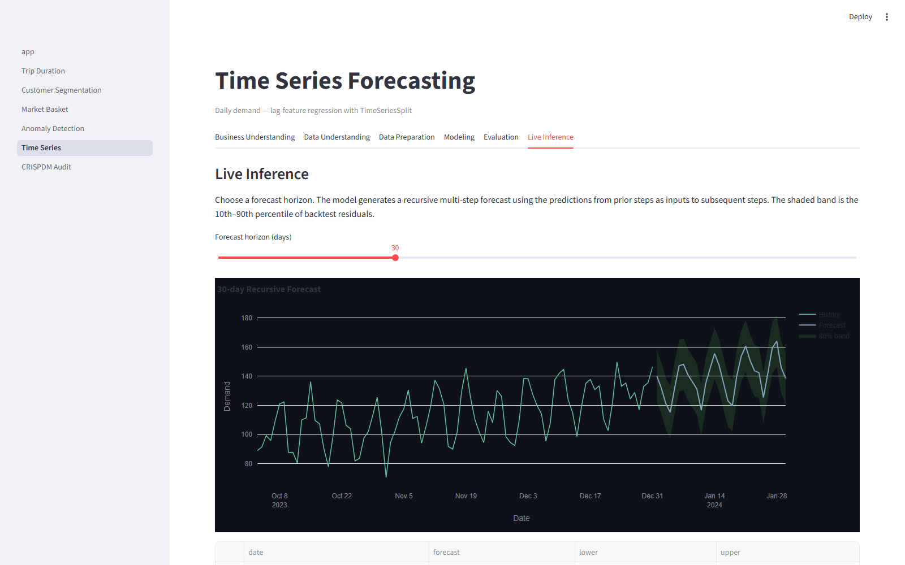
*Live Inference tab: 30-day recursive forecast from October 2023. The solid line is the point estimate; the wide shaded band is the 10th–90th percentile interval derived from backtest residuals, widening as the horizon extends.*

---

### 6 — CRISP-DM & Leakage Audit


*CRISP-DM Walkthrough tab: all six phases expanded as accordions, each describing what that phase meant concretely in this repo — specific metrics, tools, and decisions, not generic descriptions.*

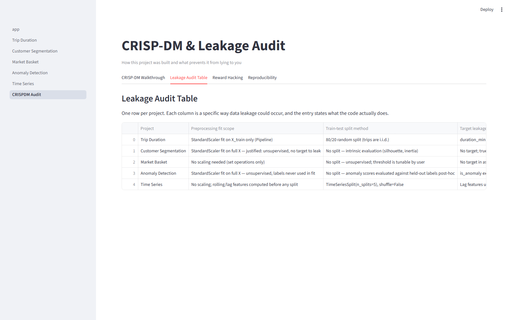
*Leakage Audit Table tab: one row per project with columns for preprocessing fit scope, train-test split method, target leakage check, seed, and metric appropriateness. The StandardScaler fit scope and TimeSeriesSplit shuffle=False entries are visible for each project.*

## Built with Claude Code

**Agent**: Claude Code CLI (claude-sonnet-4-6, Anthropic)

**Workflow**: A single detailed build prompt specified every constraint — no external data, Apriori from scratch, no leakage, CRISP-DM tab structure, 5-second training cap, fixed seeds. Claude Code generated all files (data generators, models, five project pages, audit page, home) and then ran the app to catch and fix any import or rendering errors.

**What worked**: The agent handled the sklearn Pipeline leakage constraints correctly without prompting, wrote a functional from-scratch Apriori, and structured all pages consistently.

**What I'd do differently**: Add screenshot automation in the verification step so the portfolio is fully documented immediately. The anomaly detection models are fit on an 80% training split (features only, no labels) and evaluated on a held-out 20% test set, so the reported PR-AUC is genuinely out-of-sample.

## Scope decisions

This portfolio covers 5 of the 14 projects in the reference curriculum. The tradeoff was deliberate: five projects built to depth (full CRISP-DM, live inference, leakage audit) rather than fourteen shallow demos. The CRISP-DM audit page — which documents what prevents each project from being a misleading demo — is the differentiator.
