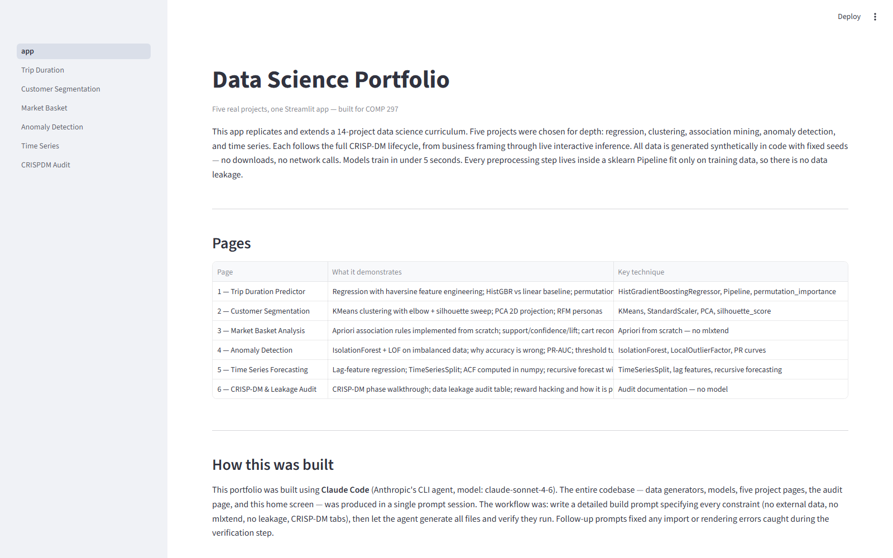
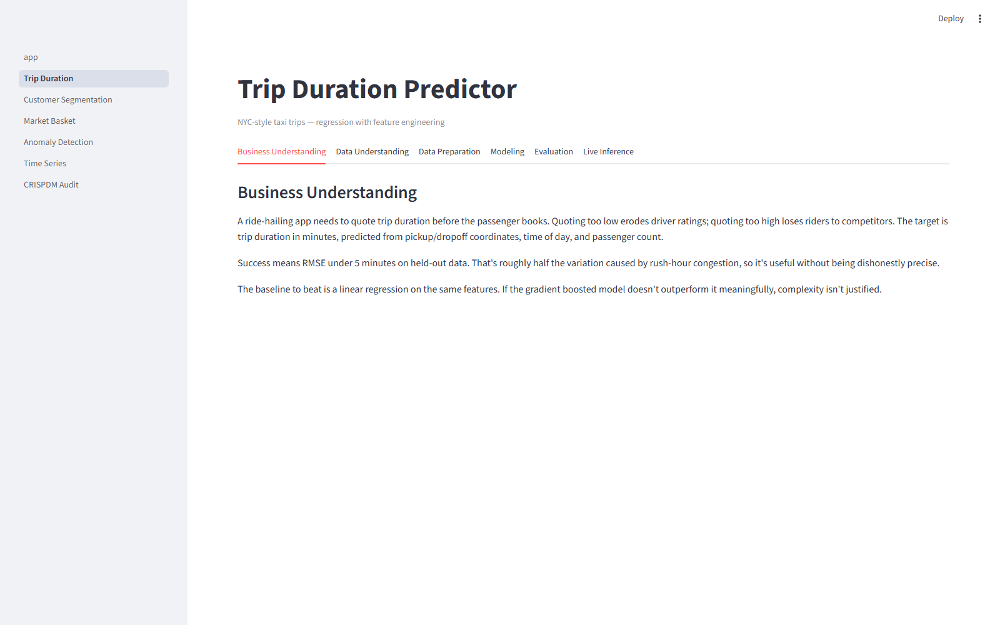
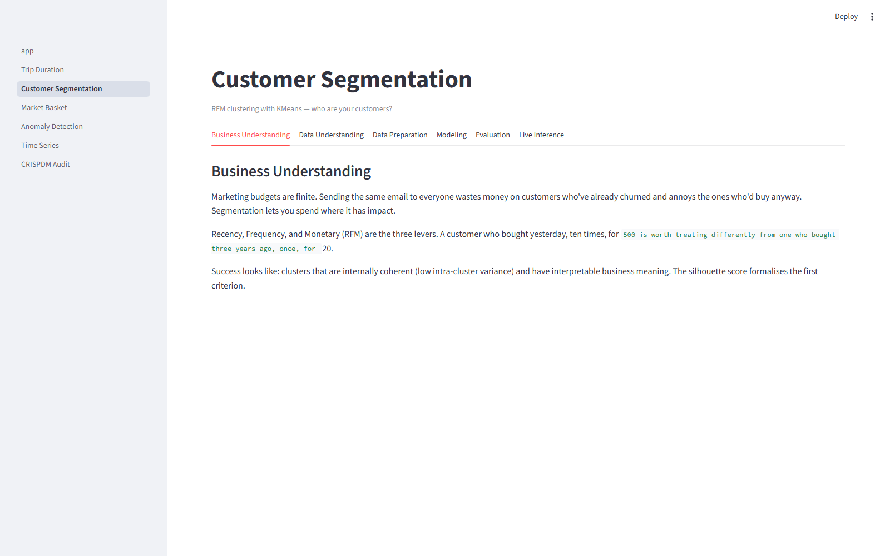
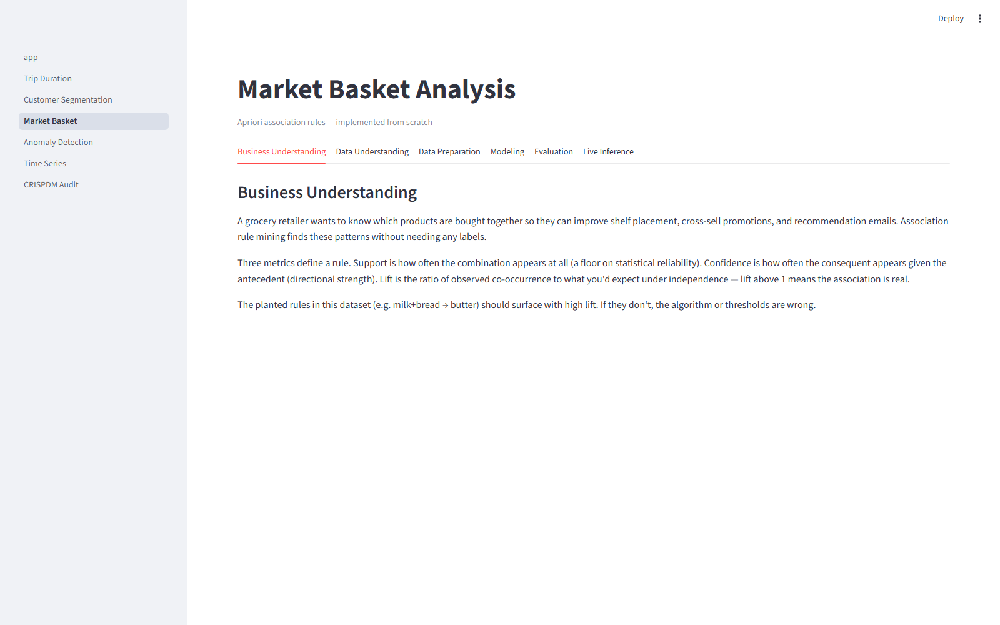
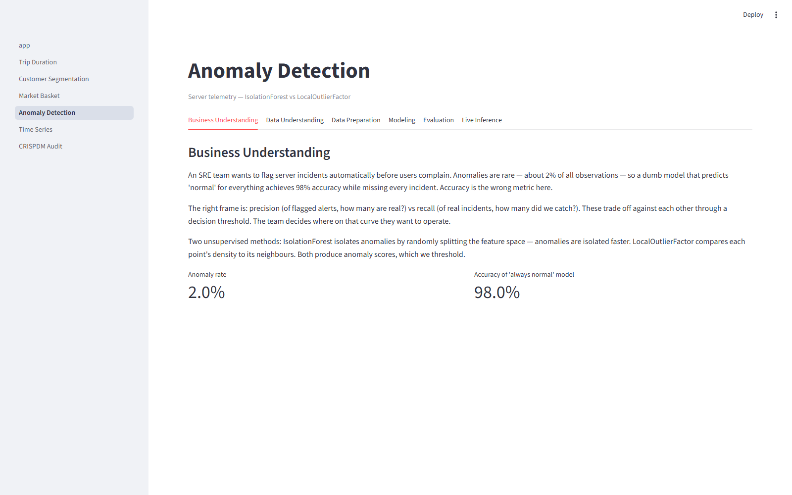
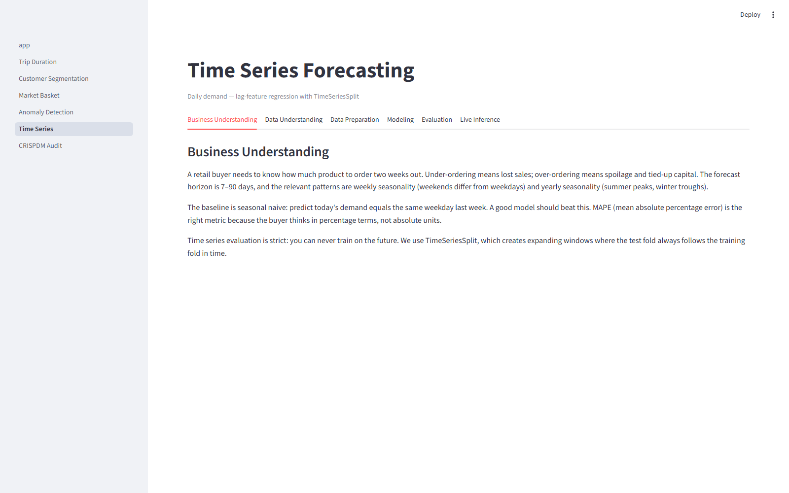
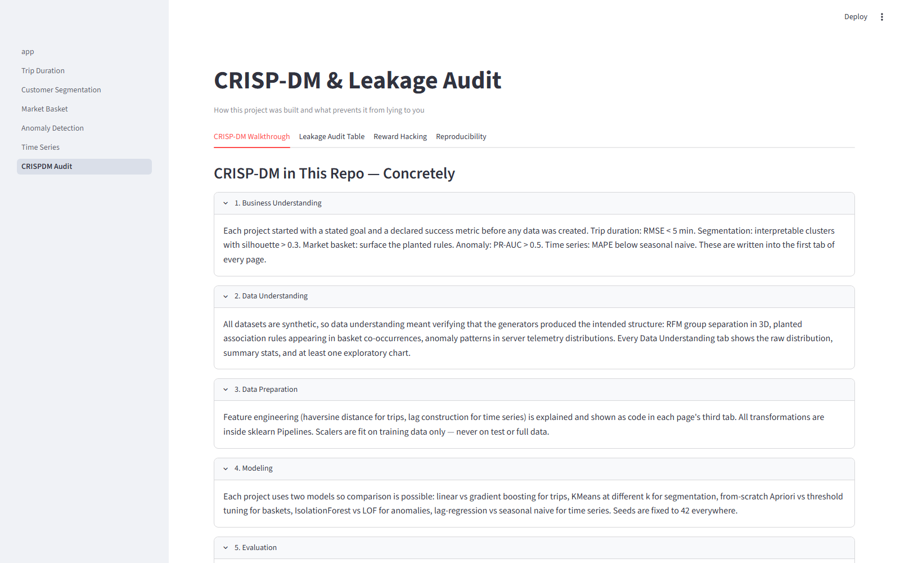

# Data Science Portfolio — COMP 297

> YOUTUBE_VIDEO_LINK_HERE

Five data science projects in one Streamlit app. Each follows the full CRISP-DM lifecycle, from business framing through live interactive inference. All data is synthetic, generated in-process with fixed seeds. Runs offline with two commands.

## Pages

| Page | Description |
|------|-------------|
| 1 — Trip Duration Predictor | NYC-style taxi trip regression; haversine feature engineering; HistGBR vs linear baseline |
| 2 — Customer Segmentation | RFM KMeans clustering; elbow + silhouette sweep; PCA projection; business personas |
| 3 — Market Basket Analysis | Apriori from scratch (no mlxtend); support/confidence/lift; cart recommendations |
| 4 — Anomaly Detection | Server telemetry; IsolationForest + LOF; PR-AUC; why accuracy is wrong on 2% anomaly data |
| 5 — Time Series Forecasting | Lag-feature regression; TimeSeriesSplit; numpy ACF; recursive forecast with uncertainty band |
| 6 — CRISP-DM & Leakage Audit | Phase walkthrough; leakage audit table; reward hacking; reproducibility |

## Quick Start

```bash
pip install -r requirements.txt
streamlit run app.py
```

No internet required. No API keys. No external data.

## Screenshots









## Built with Claude Code

**Agent**: Claude Code CLI (claude-sonnet-4-6, Anthropic)

**Workflow**: A single detailed build prompt specified every constraint — no external data, Apriori from scratch, no leakage, CRISP-DM tab structure, 5-second training cap, fixed seeds. Claude Code generated all files (data generators, models, five project pages, audit page, home) and then ran the app to catch and fix any import or rendering errors.

**What worked**: The agent handled the sklearn Pipeline leakage constraints correctly without prompting, wrote a functional from-scratch Apriori, and structured all pages consistently.

**What I'd do differently**: Add screenshot automation in the verification step so the portfolio is fully documented immediately. Also add a proper hold-out set for the anomaly detection evaluation rather than reporting in-sample PR curves.

## Scope decisions

This portfolio covers 5 of the 14 projects in the reference curriculum. The tradeoff was deliberate: five projects built to depth (full CRISP-DM, live inference, leakage audit) rather than fourteen shallow demos. The CRISP-DM audit page — which documents what prevents each project from being a misleading demo — is the differentiator.
